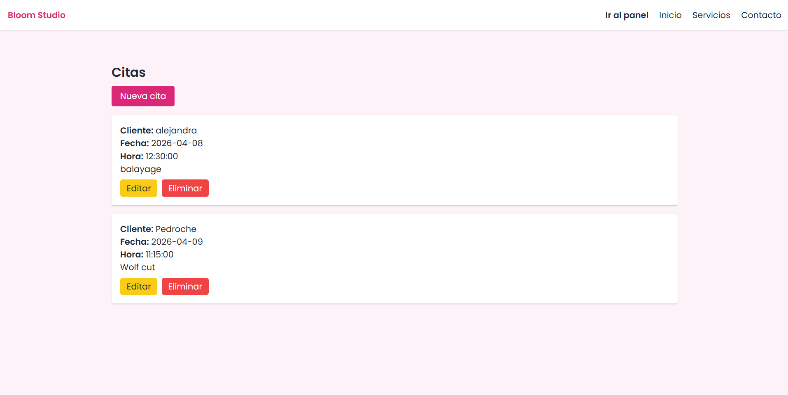

# 💇‍♀️ Bloom Studio

Aplicación web desarrollada con Laravel que simula la página de una peluquería moderna.  
Diseñada para pequeños negocios que necesitan una presencia online atractiva y rápida.

---

## 🌸 Descripción

Bloom Studio es una web pensada para peluquerías, barberías o negocios locales.

Se centra en:
- Diseño visual atractivo
- Navegación simple
- Experiencia de usuario clara

---

## 🎨 Tecnologías utilizadas

- Laravel
- Blade
- Tailwind CSS
- HTML5 / CSS3
- Laravel Breeze (autenticación)

---

## 🚀 Funcionalidades

### 🔐 Autenticación
- Registro de usuarios
- Inicio y cierre de sesión
- Redirección personalizada tras login

---

### 📅 Gestión de citas (CRUD)
- Crear citas
- Ver listado de citas
- Editar citas
- Eliminar citas
- Relación usuario → citas

### 🎨 Interfaz
- Página principal (landing)
- Sección de servicios
- Página de contacto
- Diseño responsive (móvil y escritorio)

---

## 🧱 Arquitectura

- Patrón MVC (Model - View - Controller)
- Sistema de rutas con middleware (`auth`)
- Relación 1:N entre usuarios y citas
- Controladores RESTful (`resource`)

---

## 📌 Estado del proyecto

🟡 En desarrollo

Actualmente incluye un sistema completo de gestión de citas.  
Pendiente de mejoras como:
- Validación de solapamiento de horarios
- Mejora de interfaz de usuario
- Posible integración de pagos

---

## 📸 Vista previa

### 🏠 Página principal


### ✂️ Servicios


### 📩 Contacto


### 📅 Panel de citas


---

## ⚙️ Instalación

1. Clonar el repositorio:
```bash
git clone https://github.com/lalicodes-coder/BloomStudio