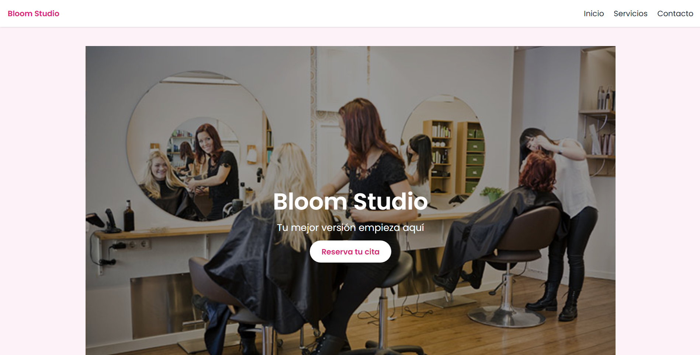
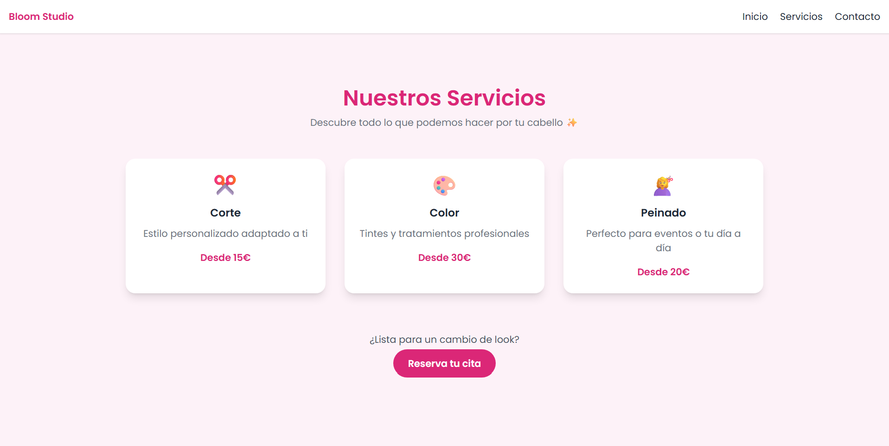
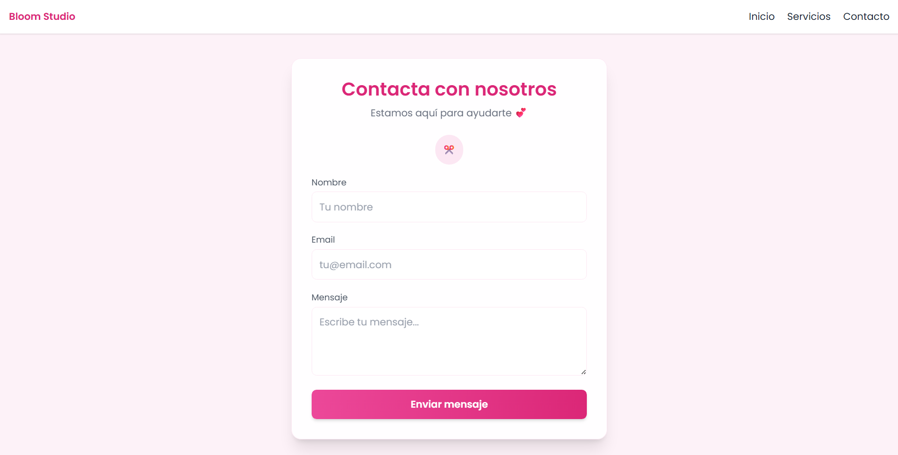

# 💇‍♀️ Bloom Studio

Aplicación web desarrollada con Laravel que simula la página de una peluquería moderna.  
Diseñada para pequeños negocios que necesitan una presencia online atractiva y rápida.

---

## 🌸 Descripción

Bloom Studio es una web pensada para peluquerías, barberías o negocios locales.

Se centra en:
- Diseño visual atractivo
- Navegación simple
- Experiencia de usuario clara

---

## 🎨 Tecnologías utilizadas

- Laravel
- Blade
- Tailwind CSS
- HTML5 / CSS3

---

## 🚀 Funcionalidades

- Página principal con hero visual
- Sección de servicios
- Página de contacto con formulario
- Diseño responsive (móvil y escritorio)
- Layout reutilizable con Blade

---

## 📸 Vista previa

### 🏠 Página principal


### ✂️ Servicios


### 📩 Contacto


---

## ⚙️ Instalación

1. Clonar el repositorio:
```bash
git clone https://github.com/lalicodes-coder/BloomStudio